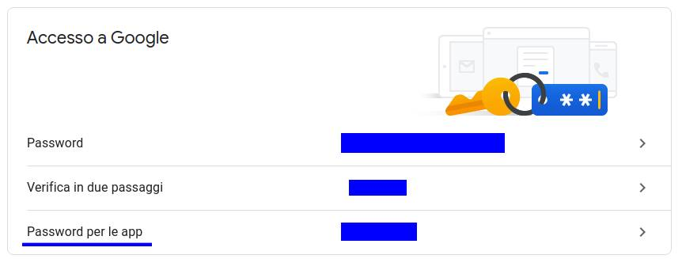

# Mail sender
Questo è uno script che permette di avere la stampa unione con l'email di google.
Questo script è stato riealizzato per un contest.

## Come eseguire
Per eseguire questo script in primo luogo bisogna creare una password per l'account di google che consente ad app esterne di accedere ai servizi ([link](https://myaccount.google.com/security?rapt=AEjHL4MbGEoWlakBM55Kv8XTcOfZgPpiF0sn6LbXOMjRPYj9pFnk5933vhH9gJGVxa0BcDmwzu1WkRwGq5kwX7oUVX-KqCwEbg)).
Cliccare la sezione sottolineata e compiere tutti i passaggi


Una volta creata la password si copia nella variabile *password* a riga 59.
```python
# external app password is required to access to the sender account
password = 'password da genereare https://myaccount.google.com/security?rapt=AEjHL4MbGEoWlakBM55Kv8XTcOfZgPpiF0sn6LbXOMjRPYj9pFnk5933vhH9gJGVxa0BcDmwzu1WkRwGq5kwX7oUVX-KqCwEbg' 
context = ssl.create_default_context()
```